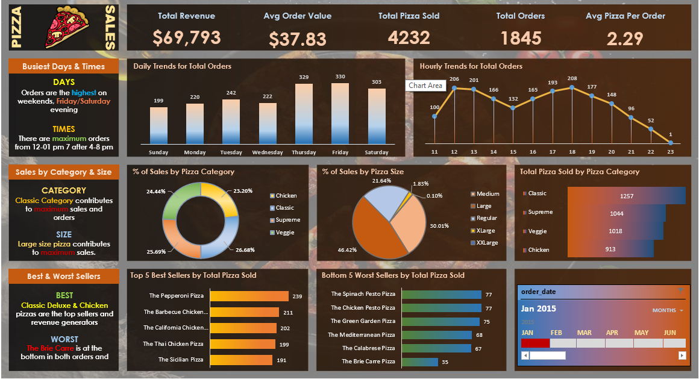

# Excel_DA_Project
A good GitHub README for a data analyst project should be concise, recruiter-friendly, and highlight your skills. Here's a template you can customize for your Pizza Sales Dashboard:

# 🍕 Pizza Sales Analysis Dashboard

## 📌 Project Overview

This project analyzes pizza sales data to uncover key business insights related to revenue, customer ordering behavior, product performance, and sales trends. The dashboard was built in Microsoft Excel using Pivot Tables, Pivot Charts, and interactive Slicers to enable dynamic analysis.

## 🎯 Objectives

* Analyze overall sales performance.
* Identify top and bottom-selling pizzas.
* Understand customer ordering patterns.
* Evaluate sales by pizza category and size.
* Provide actionable insights to support business decisions.

## 🛠️ Tools Used

* Microsoft Excel

  * Pivot Tables
  * Pivot Charts
  * Slicers
  * Conditional Formatting
  * Data Cleaning & Transformation

## 📊 Key Performance Indicators (KPIs)

* Total Revenue
* Total Orders
* Total Pizzas Sold
* Average Order Value
* Average Pizzas per Order

## 📈 Dashboard Features

* Revenue Trend Analysis
* Daily and Monthly Order Trends
* Sales by Pizza Category
* Sales by Pizza Size
* Top 5 Best-Selling Pizzas
* Bottom 5 Best-Selling Pizzas
* Interactive Filtering using Slicers

## 🔍 Key Insights

* Classic pizzas generated the highest share of orders.
* Large-sized pizzas contributed the most to overall revenue.
* Sales peaked during weekends and evening hours.
* A small group of pizza varieties accounted for a significant portion of total revenue.
* Certain pizzas consistently underperformed, highlighting opportunities for menu optimization.

## 📂 Files Included

* `Pizza_Sales_Dashboard.xlsx` – Excel dashboard workbook
* `README.md` – Project documentation
* `Dashboard_Screenshot.png` – Dashboard preview (optional)

## 🚀 How to Use

1. Download the Excel workbook.
2. Open in Microsoft Excel.
3. Use the slicers to filter data by category, size, and time period.
4. Explore the dashboard to analyze sales performance and trends.

## 📸 Dashboard Preview

## 👤 Author

**Siddhi Sharma**

* Aspiring Data Analyst
* Skilled in Excel, SQL, Power BI, Tableau, and Python
